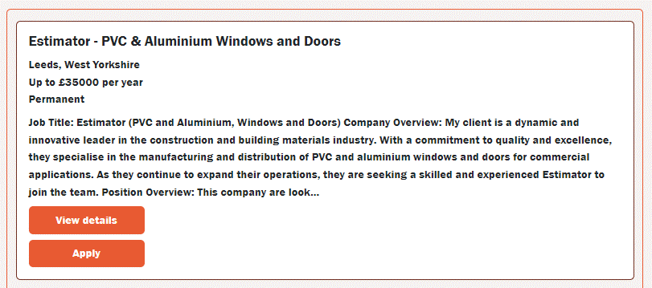

# My Third Project

## Job Finder website

This site was created to continue my self learning and to teach myself how to use the Google Maps libraries

  

## Contents

* [Introduction](#My-Third-Project)
* [Libraries and Techniques](#Libraries-and-Techniques)
* [Design (UXD)](#Design)
    * [Scope](#Scope)
    * [Structure](#structure)
    * [Designs](Assets/Designs/)
* [Features](#Features)
    * [Home Page](#Home-Page)
        * [Navigation Bar](#Navigation-Bar)
        * [Home Page Search Section](#Home-Page-Search-Section)
        * [Home Page Browse jobs by area section](#Home-Page-Browse-jobs-by-area-section)
        * [Home Page Browse jobs by sector section](#home-page-browse-jobs-by-sector-section)
    * [Jobs Page](#Jobs-Page)
        * [Jobs Page Browse jobs by sector Section](#jobs-page-browse-jobs-by-sector-section)
    * [Job Details Page](#jobs-details-page)
    * [Apply Page](#apply-page)
* [Future Feature Enhancements](#Future-Feature-Enhancements)
* [Known outstanding bugs](#Known-outstanding-bugs)

## Libraries and Techniques

* HTML - for the Web Pages
* JavaScript for the majority of the data manipulation and the backend API calls
* Local Storage - used to store various variables so I could use them between the different HTML pages

* [BootStrap](https://getbootstrap.com/) - to assist with the visuals.  I found this gave me greater control over the style and layout of the pages.
* [Adzuna](https://developer.adzuna.com/activedocs/) - provided the API data for the data
* [Express js](https://expressjs.com/) - for running the Web Server
* [NEeDB](https://dbdb.io/db/nedb) - for running my Databases
* [Goggle Maps](https://developers.google.com/maps/documentation/javascript/overview) - for the address lookup functionality

## Design

### Scope

The scope of the project was to create a website where I could use Google Maps effectively.  I decided on a Jobs search website as it provided the opportunity to use lots of different geographical locations within the Uk and thus utiliese the maps functionality.

I took inspiration from [Fish4Jobs](https://www.fish4.co.uk/jobs//) to see which features they provided and to see if I could work out how to replicate them.

### Structure

For both the Home page and the Jobs Page I wanted to make sure they had the same 'look and feel' to ensure seamless continuity as the user moved through the site.  On both pages there are:-

* Navigation Bar
    * With links Home and Jobs pages
* The same colours are used on both pages and the 'Apply' page

Home Page

* Search option which uses autocomplete for both the Keywords and Location
* Buttons for searching by
    * Type of hours
    * Type of Job
* Buttons/links to browse by major cities or more regional locations
* Links to browse by sector

Jobs Page

* Search section to be more precise with the parameters for your job search
* Window to display the jobs returned by the search

Jobs details Page

* Breakdown of the selected job
* Description of the selected job
* Map showing the location of the selected job

Apply Page

* Fields to be completed by the applicant
* Section where the applicant can upload their CV

## Features

### Home Page
 

#### Navigation Bar

* Buttons
    * Links to Home page
    * Link to Jobs page

#### Home Page Search Section
  

  * Search Input Bars with Search button - 
    * User can enter a keyword and the page will provide a selection of possible job titles or the user can continue to enter their keyword
    * User can start to type a location and the page will provide a selection of possible locations utilising Google APIs
    * Once user has completed the search bars, they click on 'Search' button and this will take them to the Jobs page and any matching jobs will be displayed
  * Links
    * Full time jobs and Part time jobs - if selected the user will be taken to the jobs page and corresponding jobs will be displayed
    * IT, Health care, Engineering, Teaching and Sales Jobs - if selected the user will be taken to the jobs page and corresponding jobs will be displayed

#### Home Page Browse jobs by area Section
  

  * Large buttons
    * These are used to search by a large city and when clicked will take the user to the jobs Page and display all job types for the selected city

  * Links
    * These are broken down to smaller areas and again when clicked will take the user to the jobs Page and display all jobs types for the selected city
    * To get this information the program searches through the Database and looks for all jobs within a larger area such as Wales, then returns the top results by number of vacancies and provides the number for each next to the corresponding link

#### Home Page Browse jobs by sector Section
  

  * Links
    * These are broken down to type of jobs and again when clicked will take the user to the jobs Page and display all jobs types for the selected city
    * To get this information the program searches through the Database and looks for all jobs within a sector,then returns the results by number of vacancies and provides the number for each next to the corresponding link

### Jobs Page
  

#### Jobs Page Browse jobs by sector Section
  

  Here the user can see how many jobs match their search criteria along with more search options to:-
  * Search by keywords with autocomplete again
  * Search by location with autocomplete again
  * Search by sectors, one or many can be chosen

  

  * Search by salary, one or many can be chosen

  

  * Search by Contract Type, one or many can be chosen

  

  * Search by Hours, one or many can be chosen

  

  Then once they have selected their search criteria, on pressing the 'search' button, any jobs matching that criteria will be displayed.

#### Jobs Page Job Card
  

  displayed on the card are all the job details and buttons to view more details and to apply for the role

### Jobs Details Page

This page displays all the details about the individual job with buttons to go back to the job search or to apply.  It also shows a map of the location of the job and uses Google Maps API to do this

### Apply Page

This page captures all the applicants details and has error handling if a name or email are not entered

## Future Feature Enhancements

1. Add automated testing using a library such as Jest.js.

2. On reset of search criteria, display all jobs

3. Currently the applicants details are not stored, adding a database for storing these would be good

## Known outstanding bugs

There are currently none that I am aware of...

