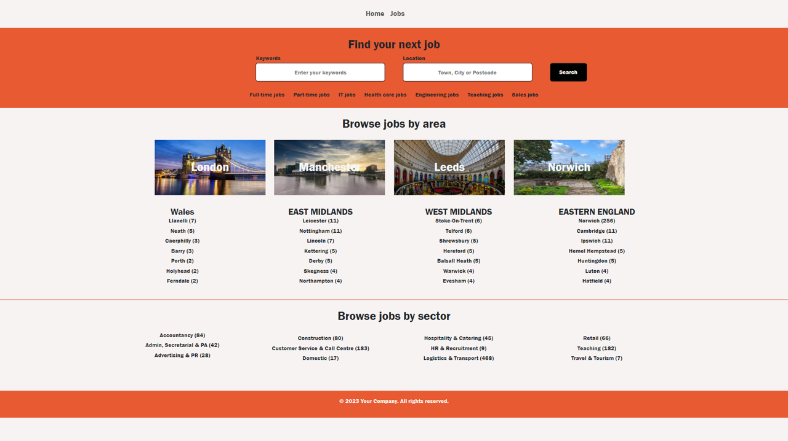

# My Third Project

## Job Finder website

This site was created to contiune my self learning and to teach myself how to use the Google Maps libraries

  

## Contents

* [Introduction](#My-Third-Project)
* [Libraries and Techniques](#Libraries-and-Techniques)
* [Design (UXD)](#Design)
    * [Scope](#Scope)
    * [Structure](#structure)
    * [Designs](Assets/Designs/)
* [Features](#Features)
    * [Home Page](#Home-Page)
        * [Navigation Bar](#Navigation-Bar)
        * [Home Page Search Section](#Home-Page-Search-Section)
        * [Home Page Brwose jobs by area section](#Home-Page-Brwose-jobs-by-area-section)

* [Manual User Testing](#Manual-User-Testing) 
* [Future Feature Enhancements](#Future-Feature-Enhancements)
* [Known outstanding bugs](#Known-outstanding-bugs)
* [Contributors](#Contributors)

## Libraries and Techniques

* HTML - for the Web Pages
* JavaScript for the majority of the data manipulation and the backend API calls
* Local Storage - used to store various variables so I could use them between the different HTML pages

* [BootStrap](https://getbootstrap.com/) - to assist with the visuals.  I found this gave me greater control over the style and layout of the pages.
* [Adzuna](https://developer.adzuna.com/activedocs/) - provided the API data for the data
* [Express js](https://expressjs.com/) - for running the Web Server
* [NEeDB](https://dbdb.io/db/nedb) - for running my Databases
* [Goggle Maps](https://developers.google.com/maps/documentation/javascript/overview) - for the address lookup functionality

## Design

### Scope

The scope of the project was to create a website where I could use Google Maps effectively.  I decided on a Jobs search website as it provided the opportunity to use lots of different geographical locations within the Uk and thus utiliese the maps functionality.

I took inspiration from [Fish4Jobs](https://www.fish4.co.uk/jobs//) to see which features they provided and to see if I could work out how to replicate them.

### Structure

For both the Home page and the Jobs Page I wanted to make sure they had the same 'look and feel' to ensure seemless continuity as the user moved through the site.  On both pages there are:-

* Navigation Bar
    * With links Home and Jobs pages
* The same colours are used on both pages and the 'Apply' page

Home Page

* Search option which uses autocomplete for both the Keywords and Location
* Buttons for searching by
    * Type of hours
    * Type of Job
* Buttons/links to browse by major cities or more regional locations
* Links to browse by sector

Jobs Page

* Search section to be more precise with the parameters for your job search
* Window to display the jobs returned by the search

Jobs details Page

* Breakdown of the selected job
* Description of the seleced job
* Map showing the location of the selected job

Apply Page

* Fields to be completed by the applicant
* Section where the applicant can upload their CV

## Features

### Home Page
 

### Navigation Bar

* Buttons
    * Links to Home page
    * Link to Jobs page

### Home Page Search Section
  

  * Search Input Bars with Search button - 
    * User can enter a keyword and the page will provide a selection of possible job titles or the user can continue to enter their keyword
    * User can start to type a location and the page will provide a selection of possible locations utilising Google APIs
    * Once user has completed the search bars, they click on 'Search' button and this will take them to the Jobs page and any matching jobs will be dispalyed
  * Links
    * Full time jobs and Part time jobs - if selected the user will be taken to the jobs page and corresponding jobs will be dispalyed
    * IT, Health care, Engineering, Teaching and Sales Jobs - if selected the user will be taken to the jobs page and corresponding jobs will be dispalyed

### Home Page Brwose jobs by area section
  
  * Filters
    * Cuisine Type - Choose a country
    * Meal Type - Breakfast, lunch, dinner etc
    * Dish Type - Starter, salad, soup etc

  * Recipe cards
    * Each card displays:-
        * Recipe Image - clickable and takes the user to URL
        * Recipe Title - clickable and takes the user to URL
        * Meal Type
        * Dish Type
        * Cuisine Type
        * Number the recipe serves

  * Shopping Cart
    * Displays currently selected items from the shopping page with:
        * The option to delete an item
        * Button to click through to the checkout

### Shopping Page
  
  
 * Search Input Bar with Search and reset buttons - 
    * User can use 'fuzzy search' to find items
    * Utilises 'focus' on search bar so a user can press the 'enter' key once they have typed and this will carry out the same functionality as clicking the 'search' button
    * If any products match the search phrase they will be displayed
    

    * Also the option to filter by price -
        * High to Low 
        * Low to High
    

    * If no matches, a message will be displayed
     
    

 * Product filters
    * On clicking, any products equal to the selected type will be displayed
    * Selected 'type' button will be highlighted
    
  

 * Product Cards
    

    * Product Image
    * Product Price
    * Amount in Stock 
    * Amount selected and in the cart
    * Input box to enter quantity
    * Add to cart box

    If the item is out of stock, the following are displayed
    * Product Image
    * Product Price
    * Out of stock message

    Stock amounts can be amended in the [Admin Portal](#Admin-Portal)

    If an item is selected and added to the shopping cart, the 'In Cart' section will be highlighted and will reflect the number in the cart.

    If the amount in the input box is increased or decreased, this is reflected in both the 'In Cart' section and the [Shopping cart](#Shopping-cart).

    If a user clicks on the **Product Image** or **Product Price** this will display the [Product View Page](#Product-View-Page).

### Product View Page

All the information from the item which was clicked is displayed.  This includes pulling through the number already in the cart and populating the quantity input box.  Again, if you amend the quantity it will be reflected in the 'In Cart' section and be highlighted.

* Recipe Carousel
    * The 3 filters from the Recipe Page are used here again, once selected, a user clicks search and a carousel will be displayed which scrolls automatically on a 2 second delay
    * If the user hovers over an image the carousel will stop
    * If the user clicks on an image it will open that recipe in a new page

### Shopping Cart

* Contains all the items chosen by the user:-
    * Product Price
    * Quantity chosen
    * Total price of the product * quantity chosen
* Red 'x'
    * If a user clicks this it will delete the item from the shopping cart and update the individual product card
* Sub Total
    * Price of all items in the Shopping Cart
* Checkout Button
    * If a user click this it takes them to the [Checkout Page](#Checkout-Page)

### Checkout Page

#### Left hand side

Displays number of items in the cart, if items is equal to 1 then it displays the word **item**, if there are more than 1 it displays **items**

* List of items in cart - 1 line per **Product Title**
    * Product Image
    * Product Title
    * Quantity
    * Total price of the product * quantity chosen

    * Total Price of cart

#### Right hand side

* #### Address section
    * Displays the **Default** Address and a button to change the address - this takes the user to the [Address Choice](#Address-Choice) popup
* #### Delivery Slot Chooser
    * Displays a button to choose a delivery slot and a message detailing either
        * "No slot selected"

            or

        * the date, time and price of the selected slot

        On clicking the 'Choose Delivery Slot' button the delivery slot window is displayed
    

    *   The dates shown are always today and the next 6 days.  When a user selects a slot the background and the text in the selected slot change.  This will then be used to populate the message under the 'Choose Delivery Slot' on the Checkout Screen.

                

* #### Apply discount code
    * Displays an input box to enter a discount code and a button to add that code
    * 3 options are possible with the discount codes:
        * Invalid code
        

        * Successful code
        

        * Only 1 code is allowed
        
    
    If a code is a valid one, the total cost of the shopping cart is reduced by the discount %

* #### Checkout Button

    Displays the total checkout price (including the discount if a valid code was entered).  On clicking of the Checkout Button:-

    * An [email](#email-sent-to-user) is sent to the user with their order details
    * A [popup message](#email-popup) is displayed confirming an email has been sent

### Email

* #### Email sent to user

    User receives an email containing all the information gathered throughout the shopping process:-
    *   Website Logo
    *   Delivery details
    *   Product details, quantities, prices
    *   Total price of the order including the delivery charge
    *   Delivery address

    

* #### Email popup

    On clicking the checkout button a pop up is displayed
     
    
    When the user clicks the **Close** button, the recipe page is displayed

### Address Choice

When a user has clicked on the 'Change' button next to the address on the Checkout page, the Address Choice pop up is displayed

 

* A user can either choose one of the addresses shown and the click the 'Use this address' button to take them back to the [Checkout Page](#Checkout-Page)
* Cancel and take them back to the [Checkout Page](#Checkout-Page) and the address will not have changed
* Click on the [Add new address](#New-Address-Lookup) button

### New Address Lookup
 

When a user starts to type in the 'Address First Line' the program will provide a list of addresses and when a user selects one it will complete the reaming address details.

If the user wants to use that address, they click on 'Add Address' button and the address will be added to the list on the [Address Choice](#Address-Choice) popup.

## User Account Management

When a user clicks the 'Account' button on the Navigation bar they will get the Popup where they can manage their [addresses](#Address-Management) and view their [Previous Orders](#Previous-Orders).

### Address Management

Here a users **Default** address is shown at the top and has a grey background.  A user can:-

* Set an address as **Default** by clicking the button under the relevant address card
* Remove an address - this will delete it from the Address book, **Unless** it is the **Default** one.  If the user tries this they will be shown an alert
    

* Add a new address using the [Add Addresses](#new-address-lookup) button

### Previous Orders

Clicking on the 'Previous Orders' button displays all the previous orders by incremented order number

### Admin Portal

This is where an Admin can make changes to the [Stock numbers](#Stock-Control), amend the [Discount Codes](#Discount-Codes) and reset the [Previous Orders](#Previous-Orders) and [Address Book](#Address-Management).

* The login is controlled in the backend by a C# API call.  

* If the Admin enters incorrect details they will see the below pop up.

* If they add valid details the Admin Management section will be shown

#### Stock Control

* Here the Admin can choose the 'Type' of the product they want to update.  Upon clicking a 'Type' the relevant items will be shown and the 'Type' button will be highlighted.

* Any updates made here will be reflected back on the shopping Page so all cards 'Stock' numbers will match those of the cards here.

#### Discount Codes

* Here the Admin can amend current codes and then click the 'Update' button.
* Delete a code by clicking the 'Delete' button.
* Add a new code, clicking the 'Add discount code' button will add a new line to the bottom of the codes section

#### Memory Destruct

This button was implemented in the early days of the project when Local Storage was added.  Local storage has a limit and sometime the Previous orders can become full.

* clicking the 'Memory Destruct' button will clear the Previous Orders and reset the Address book back to the ones stored in the server code.  It will also give an alert to confirm it has been successful

## Video Page

Here a user can select either of the videos by clicking on the 'Watch Now. buttons.  This will bring up the selected video, which can be played on within the website of the user can watch on [YouTube](https://www.youtube.com/).

## Chatbot

The Chatbot (Helping Handy) is fed from information I have provided it about the site, such as product lists and information about deliveries.  It is able to answer questions about product availability and prices.

## Manual User Testing

Until automated testing has been incorporated into the code, the testing was carried out manually.  An example of the testing carried out can be found [here](Assets/Manual%20Testing/Manual%20Testing.md).

## Future Feature Enhancements

1. I would like to enhance the capabilities of the chatbot so that it could interact with the site and be able to provide links to products - this will require hosting the site.

2. It would also be interesting to look into how to create analysis of the customers orders and utilise libraries like [chartjs.org](#https://www.chartjs.org/) to produce interactive analytics.

3. Add automated testing using a library such as Jest.js.

4. On the Recipe page if there are no results returned, add a message informing of this.

5. Convert the Local Storage code to use Databases

## Known outstanding bugs

1. Previous Orders sometimes duplicate
    * Clicking back and forth through the site can cause items to be duplicated when the order is completed and the previous order is populated - This does not affect actual orders.

2. Intermittent behaviour when on the 'choose new address screen'. 
     * Sometimes when a user clicks on 'cancel' the program will take the user back to the recipe screen.  Other times it will act as expected.

## Contributors

Thanks goes to Colin Mattholie for reviewing the build each week and providing valuable feedback and spotting bugs.  Thanks also goes to Paul Ginn for the idea of adding the discount code section.  

Also, thanks goes to Gareth Holmes for showing me the great GitHub work done by [Martin Ward](https://github.com/mwarddev), which has inspired me to create this ReadMe.

Many thanks also to the numerous You-Tubers who have led me down many a rabbit hole, without whom I would not have been able to create this site. 

